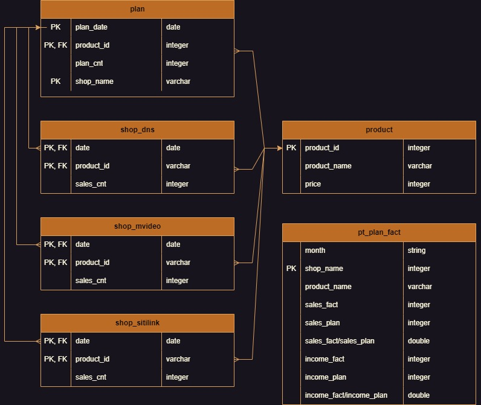

Инициализация базы данных "Sales"

Запуск: `docker-compose up`

Задача:  

Разработать SQL-скрипт, который формирует таблицу со следующим набором атрибутов:

**shop_name** — название магазина,  
**product_name** — название товара,  
**sales_fact** — количество фактических продаж на конец месяца,  
**sales_plan** — количество запланированных продаж на конец месяца,  
**sales_fact/sales_plan** — отношение количества фактических продаже к запланированному,  
**income_fact** — фактический доход,  
**income_plan** — планируемый доход,  
**income_fact/income_plan** — отношение фактического дохода к запланированному.  
```sql
WITH fact_plan AS (
    SELECT
        plan.shop_name AS shop,
        extract(month FROM plan.plan_date) AS month,
        product.product_name AS product,
        (CASE
            WHEN shop_name = 'dns' THEN (SELECT sum(sales_cnt) FROM shop_dns WHERE shop_dns.product_id = plan.product_id)
            WHEN shop_name = 'mvideo' THEN (SELECT sum(sales_cnt) FROM shop_mvideo WHERE shop_mvideo.product_id = plan.product_id)
            WHEN shop_name = 'sitilink' THEN (SELECT sum(sales_cnt) FROM shop_sitilink WHERE shop_sitilink.product_id = plan.product_id)
        END)  AS sales_fact,
        (CASE
            WHEN plan.product_id = 1 THEN (SELECT sum(plan.plan_cnt) FROM plan WHERE plan.product_id = 1)
            WHEN plan.product_id = 2 THEN (SELECT sum(plan.plan_cnt) FROM plan WHERE plan.product_id = 2)
            WHEN plan.product_id = 3 THEN (SELECT sum(plan.plan_cnt) FROM plan WHERE plan.product_id = 3)
        END) AS sales_plan,
        product.price AS price
    FROM plan
        INNER JOIN shop_dns ON plan.plan_date = shop_dns.date
        INNER JOIN shop_mvideo ON plan.plan_date = shop_mvideo.date
        INNER JOIN shop_sitilink ON plan.plan_date = shop_sitilink.date
        INNER JOIN product ON plan.product_id = product.product_id
    GROUP BY shop, month, product, price, sales_fact, plan.product_id
    ORDER BY shop, month
)
SELECT
    month,
    shop,
    product,
    sales_fact,
    sales_plan,
    round(cast((sales_fact / sales_plan::double precision) AS numeric), 2) AS seles_fact_plan,
    (price * sales_fact) AS income_fact,
    (price * sales_plan) AS income_plan,
    cast(((price * sales_fact) - (price * sales_plan)) AS numeric) AS income_fact_plan
FROM fact_plan
ORDER BY month, shop
```  

Схема БД: 


